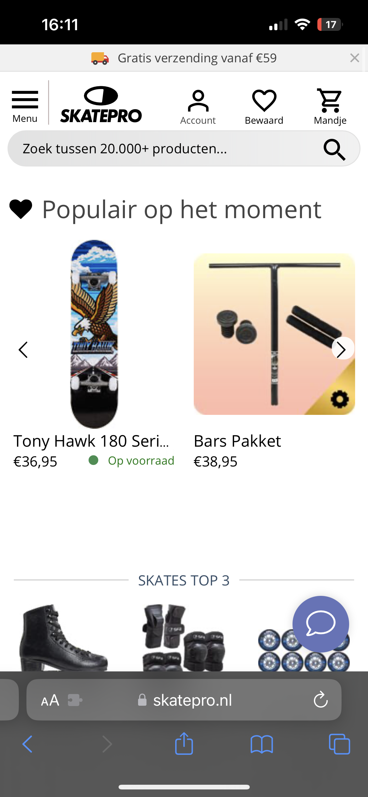
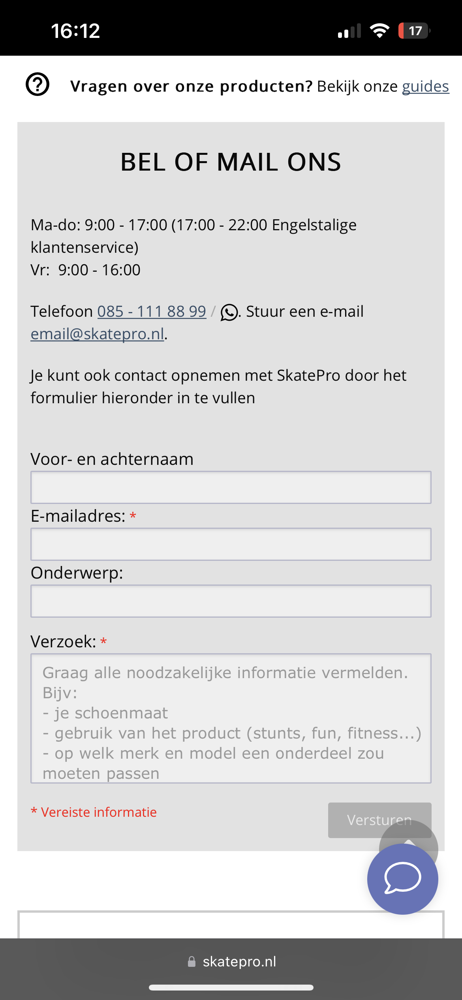
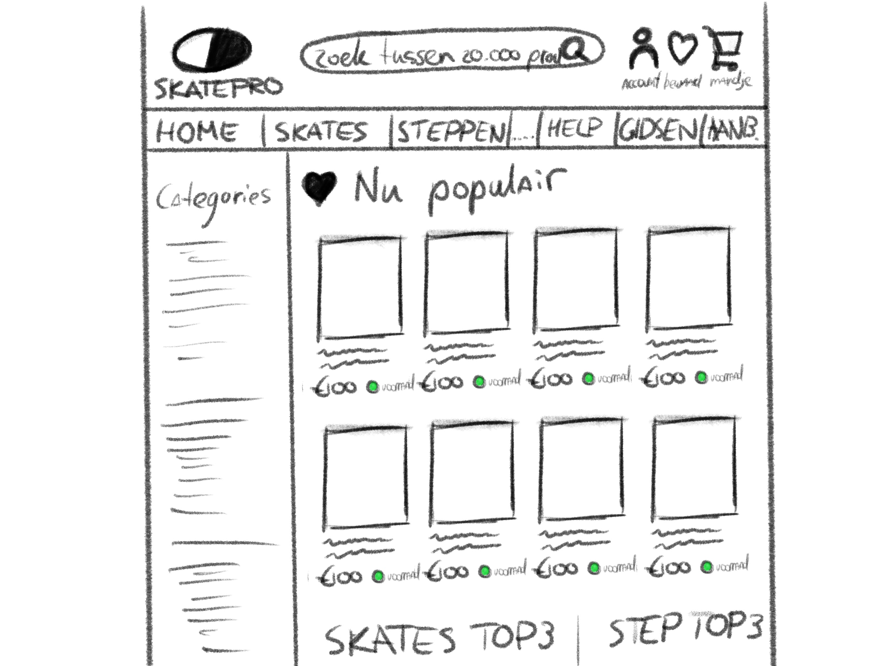
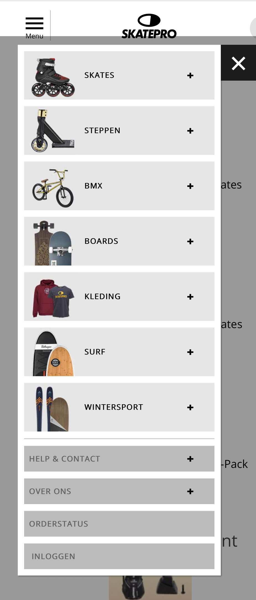

# Procesverslag
Markdown is een simpele manier om HTML te schrijven.  
Markdown cheat cheet: [Hulp bij het schrijven van Markdown](https://github.com/adam-p/markdown-here/wiki/Markdown-Cheatsheet).

Nb. De standaardstructuur en de spartaanse opmaak van de README.md zijn helemaal prima. Het gaat om de inhoud van je procesverslag. Besteedt de tijd voor pracht en praal aan je website.

Nb. Door *open* toe te voegen aan een *details* element kun je deze standaard open zetten. Fijn om dat steeds voor de relevante stuk(ken) te doen.

## Jij

  
uitwerken voor kick-off werkgroep

  ### Auteur:
  Tijn Vrusch

  #### Je startniveau:
  blauw

  #### Je focus:
  responsive
 

## Je website

  
uitwerken voor kick-off werkgroep

  ### Je opdracht:
  https://www.skatepro.nl/

  #### Screenshot(s) van de eerste pagina (small screen): 
  Home
  

  #### Screenshot(s) van de tweede pagina (small screen):
  Contact
  
 

## Toegankelijkheidstest 1/2 (week 1)

  
uitwerken na test in 1e werkgroep

  ### Bevindingen
  Lijst met je bevindingen die in de test naar voren kwamen:
  - Met de screen reader moet je (door te tabben) eerst langs alle navigatie- en productcategorieënlinks, voordat je bij de main content (producten) van de homepagina komt.
  - De zoekbalk bovenaan de pagina kan niet geselecteerd/gefocust worden door te navigeren met tab.
  
  #### Screenreader
  Hier korte omschrijving (met indien nodig afbeeldingen)
  - Het duurt extreem lang om door alle links heen te navigeren om bij de (belangrijkste) content te komen.
  Hier een omschrijving van hoe het opgelost kan worden (met indien nodig afbeeldingen)
  - Een content skip link bovenaan de website die ervoor zorgt dat je de onnodige links over kan slaan.
  - Misschien de navigatiebalk niet bovenaan de pagina zetten, ookal is dat voor 'normale' gebruikers niet optimaal, het is een workaround.

  #### Muis en Toetsenbord 
  Hier korte omschrijving (met indien nodig afbeeldingen)
  - Met muis en toetsenbord is de website goed te gebruiken zonder grote problemen.
  - Sommige links (bv die aan de linker navbar) zijn relatief klein in verhouding tot de rest van de website, wat de leesbaarheid een beetje kan beperken.
  Hier een omschrijving van hoe het opgelost kan worden (met indien nodig afbeeldingen)

  #### Motoriek (shocks, elastiekjes)
  Hier korte omschrijving (met indien nodig afbeeldingen)
  - Als iemand bv parkinson's heeft (of in ieder geval 2 trillende armen/handen) kan het erg lastig zijn om de cursor goed te bedienen met de touchpad of een muis. Als de trillingen heel heftig zijn, kan het ook dat gebruik van het toetsenbord problemen geeft als verkeerde toetsaanslagen.
  - Als sommige vingers niet goed te bewegen zijn of meetrillen, kan het ook lastiger zijn om een website op je mobiele telefoon te gebruiken. Zo'n klein scherm met kleine links en buttons. 
  Hier een omschrijving van hoe het opgelost kan worden (met indien nodig afbeeldingen)
  - Knoppen en links groter maken, zodat de x- en y-verschuiving van de trillingen er niet meer voor zorgen dat je naar de knop/link klikt.
  - Mobiele (en misschien ook tablet) website grotere buttons en links geven. 

  #### Visueel (brillen, contrast, kleurenblind, dark/light). 
  Hier korte omschrijving (met indien nodig afbeeldingen)
  Diabetes bril: 
  - Het lijkt wel alsof er allemaal sneeuwvlokjes voor mijn ogen zitten. Het is erg lastig om kleine letters te lezen zonder mijn hoofd mee te bewegen.
  - Het is lastig om het overzicht te houden over de hele website, doordat bijna overal het gezichtsbeeld
  - Ook is het heel lastig om met je ogen grote afstanden af te leggen (helemaal van de linker- naar de rechterkant van de pagina bijvoorbeeld).
  Tunnel vision bril:
  - Je hele gezichtsveld wordt zwart behalve een heel klein puntje in het midden van elk ook. Dit maakt het bijna onmodgelijk om snel dingen te vinden en overzicht te houden op de website. 
  Hier een omschrijving van hoe het opgelost kan worden (met indien nodig afbeeldingen)
  - Zorgen dat tekst groot genoeg is om duidelijk leesbaar te zijn voor mensen met zichtproblemen door diabetes (ook niet te groot, want dan is het lastig te lezen).
  

## Breakdownschets (week 1)

  
uitwerken na afloop 2e werkgroep

  ### de hele pagina: 
  

  

  ### dynamisch deel (bijv menu): 
  

  <!-- ### wellicht nog een dynamisch deel (bijv filter):  -->
  <!--  -->

Bevindingen symposium 12 september

- Skip to content link voor mensen die dmv screen readers de site gebruiken (dit kan als eerste linkje in de footer helemaal bovenaan de pagina, zodat je er meteen komt als je op tab drukt).
- Het is belangrijk om goede, semantisch correcte HTML te schrijven voordat je doorgaat naar de CSS. Anders zul je later je CSS weer opnieuw aan moeten passen nadat je je HTML gefixt hebt.
- Geen onnodige alt-text achter afbeeldingen (of andere items), en als je wel alt-text gebruikt moet die zo relevant mogelijk is. Zo blijft de website toegankelijk voor mensen die bijvoorbeeld slechtziend zijn en de site alleen kunnen gebruiken als screen reader.
- Vaak kun je, door de toegankelijkheid voor een specifieke doelgroep een veel grotere doelgroep bereiken van mensen die vergelijkbare problemen hebben oid, en dus (in mindere mate) dezelfde gebruikersproblemen ervaren. 
- Ik merkte op dat de website van SkatePro.nl verandert naar de desktop versie van de site bij een schermbreedte van 1250px;

## Voortgang 1 (week 2)

  
uitwerken voor 1e voortgang

  ### Stand van zaken
  Ik heb mijn basiskennis van HTML en CSS al aardig opgeschroefd. Flexbox en grids maken nu eindelijk sense door de handige oefensites Flexbox Froggy en Grid Garden!
  Ik wil deze week ook aan de slag gaan met FlukeOut om mijn kennis over selectors te testen en uit te breiden.
  Tot nu toe heb ik deze nieuwe manieren geleerd om selectors toe te passen: p > a & p + a.
  Ik hoorde dat we vanaf volgende week aan de slag gaan met JavaScript. Daar ben ik nu nog helemaal niet goed in, dus dat kan nog wel eens intimiderend worden. Het is echter wel belangrijk dat ik (in ieder geval) een redelijke fundering leg voor simpele dingen in JS. Dit helpt ook om een gevoel en inzicht te krijgen in programmeren in zijn algemeenheid en zal het makkelijker maken om nieuwe computertalen op te pakken die complexer zijn zijn JavaScript, maar wel gebruikmaken van vergelijkbare patronen of inzichten.

  ### Agenda voor meeting
  samen met je groepje opstellen

  | student 1      | student 2          | student 3     | student 4                |
  | Bente          | Ryan               | Lisa          | Tijn                     |
  | HTML accessible| Voortgang          | Voortgang     | hamburger menu uitklappen|
  | maken. + iets  |                    |               | / JavaScript basics      |
  | specifieks     | ...                | ...           | ...                      |

  ### Verslag van meeting
  hier na afloop snel de uitkomsten van de meeting vastleggen

  - punt 1
  - punt 2
  - nog een punt
  - ...

## Voortgang 2 (week 3)

  
uitwerken voor 2e voortgang

  ### Stand van zaken
  hier dit ging goed & dit was lastig (neem ook screenshots op van delen van je website en code)

Ik doe op de een of andere manier iets fout bij het linken naar mijn img elementen.

  ### Agenda voor meeting
  samen met je groepje opstellen

  | student 1      | student 2          | student 3       | student 4        |
  | Tijn           | ---                | ---             | ---              |
  | images links?  | en dit             | en ik dit       | en dan ik dat    |
  | href > ./?     | dit als er tijd is | nog een punt    | dit wil ik zeker |
  | ...            | ...                | ...             | ...              |

Doe/begrijp ik iets verkeerd met semantisch correct tabben? In product blokjes komt het niet uit.

  ### Verslag van meeting
  hier na afloop snel de uitkomsten van de meeting vastleggen

  - 
- ...

## Toegankelijkheidstest 2/2 (week 4)

  
uitwerken na test in 8e werkgroep

  ### Bevindingen
  Lijst met je bevindingen die in de test naar voren kwamen (geef ook aan wat er verbeterd is):

  Mijn site werkt nu al veel beter met een screen reader / tab dan de originele site. Het was bij het origineel vrijwel onmogelijk om door het navigatiemenu te tabben, om bij de rest van de website te komen. Zo moeten mensen zonder een muis (of met een beperking) eerst super lang luisteren naar allemaal onnodige linkjes in de navbar, voordat ze bij de content van de pagina aankomen. 

  #### Screenreader
  Hier korte omschrijving (met indien nodig afbeeldingen)

  Hier een omschrijving van hoe het opgelost kan worden (met indien nodig afbeeldingen)

  Ik merkte al snel dat mijn afbeeldingen (zowel het logo als de menu buttons en de productfoto's) geen (juiste) alt-text hebben. Een screen reader zou dan de volledige naam van de afbeeldingen voorlezen ipv alleen de nuttige alt-text. 

  #### Muis en Toetsenbord 
  Hier korte omschrijving (met indien nodig afbeeldingen)

  Hier een omschrijving van hoe het opgelost kan worden (met indien nodig afbeeldingen)

  Ik heb, om de navigatie van de website gemakkelijker te maken voor beperkte gebruikers, een skip link button toegevoegd bovenaan mijn HTML. Deze link is automatisch verborgen (uit het scherm getransleerd), totdat je begint met tabben en de link dus focus krijgt. Wanneer je dan vervolgens op Enter drukt, skip je naar de main content van de pagina.

  #### Motoriek (shocks, elastiekjes)
  Hier korte omschrijving (met indien nodig afbeeldingen)

  Hier een omschrijving van hoe het opgelost kan worden (met indien nodig afbeeldingen)

  Shocks (of elastiekjes) maken een groot verschil in de behendigheid van iemand's handen en vingers. Bij lichte shocks of trillingen is het vaak nog wel mogelijk (ookal is het omslachtig) om het toetsenbord te gebruiken als tekst input en link / button navigation. 
  Gebruik van een muis of touchpad is in mijn beleving als helemaal lastig, voor sommigen zelfs vrijwel onmogelijk. Het lijkt me daarom voor de meeste mensen die motorisch beperkt zijn (trillingen, schokjes whatever) erg belangrijk dat de website toegankelijk genoeg is om goed te kunnen navigeren met een screen reader of tab.

  #### Visueel (brillen, contrast, kleurenblind, dark/light). 
  Hier korte omschrijving (met indien nodig afbeeldingen)

  Hier een omschrijving van hoe het opgelost kan worden (met indien nodig afbeeldingen)

  Het is met die tunnel vision bril vrijwel onmogelijk om je cursor te vinden op het scherm. Het zou misschien helpen als mensen die op deze manier slechtziend zijn een grotere cursor te zien krijgen zodat ze iets makkelijker kunnen zien waar ze nu bezig zijn. Verder zullen ze uiteraard zoveel mogelijk gebruikmaken van tab, als alternatieve manier om de links / buttons van de pagina af te gaan. 

## Voortgang 3 (week 4)

  
uitwerken voor 3e voortgang

  ### Stand van zaken
  hier dit ging goed & dit was lastig (neem ook screenshots op van delen van je website en code)

  ### Agenda voor meeting
  samen met je groepje opstellen

  | student 1      | student 2          | student 3    | student 4        |
  | ---            | ---                | ---          | ---              |
  | dit bespreken  | en dit             | en ik dit    | en dan ik dat    |
  | en dat ook nog | dit als er tijd is | nog een punt | dit wil ik zeker |
  | ...            | ...                | ...          | ...              |

  ### Verslag van meeting
  hier na afloop snel de uitkomsten van de meeting vastleggen

  - punt 1
  - punt 2
  - nog een punt
  - ...

## Eindgesprek (week 5)

  
uitwerken voor eindgesprek

  ### Je uitkomst - karakteristiek screenshots:
  

  ### Dit ging goed/Heb ik geleerd: 
  Korte omschrijving met plaatjes

  

  ### Dit was lastig/Is niet gelukt:
  Korte omschrijving met plaatjes

  

## Bronnenlijst

  
continu bijhouden terwijl je werkt

  Nb. Wees specifiek ('css-tricks' als bron is bijv. niet specifiek genoeg).

  1. bron 1
  2. bron 2
  3. ...

